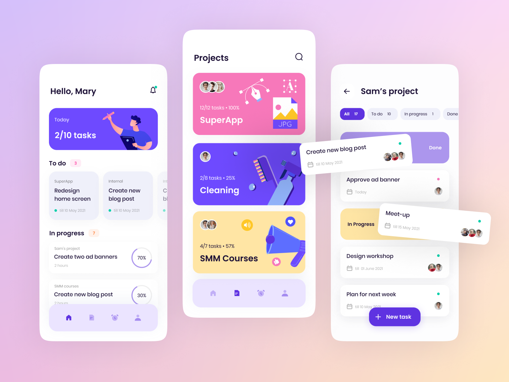

# Taskify

Taskify is an ongoing open source Android and IOS application that is can be used by UI/UX designers and Developers to collaborate easily by creating a project in Taskify.

## Screenshots

## Features
- Create project with Logo and description.
- Project lists.

## Upcoming Features
 - Chat about the project.
 - Discover other teams and projects.
 - Dark theme.

 ## Contributing
  - Please feal free to contribute on this project.

## Notice

 Please note that this project is still maintained.

  Made with ❤ by Karl Mathuthu.
