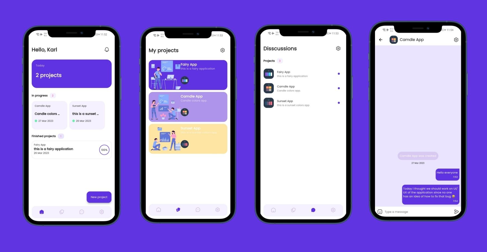

# Taskify

Taskify is an ongoing open source Android and IOS application that is can be used by UI/UX designers and Developers to collaborate easily by creating a project in Taskify.

## Screenshots

## Features
- Create project with Logo and description.
- Project lists.
 - Chat/Discuss about your projects with your team mates.

## Upcoming Features
 - Discover other teams and projects.
 - Dark theme.

## Donation
Please try to impress me by donating with anything you have got.I will appreciate more than you will think.

<form action="https://www.paypal.com/donate" method="post" target="_top">
<input type="hidden" name="hosted_button_id" value="CC2HKYVZUX79Y" />
<input type="image" src="https://www.paypalobjects.com/en_US/i/btn/btn_donateCC_LG.gif" border="0" name="submit" title="PayPal - The safer, easier way to pay online!" alt="Donate with PayPal button" />

</form>

## Notice

 Please note that this project is still maintained.
 In settings i know i'm not done yet so don't be surprised.

## Developer

  Made with ❤ by Karl Mathuthu.
